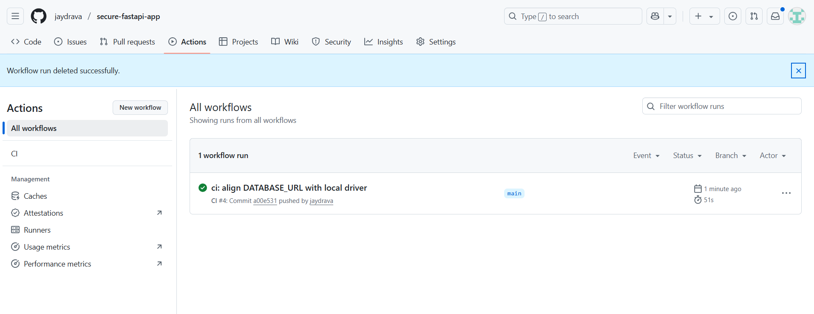
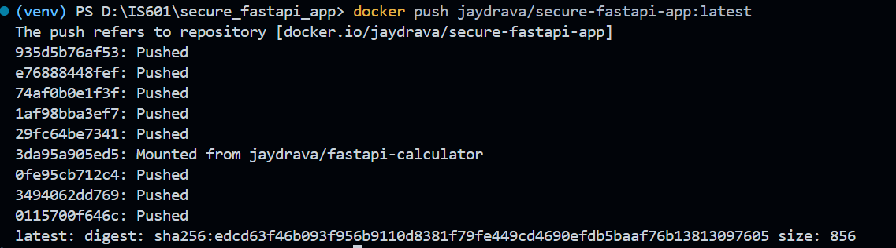
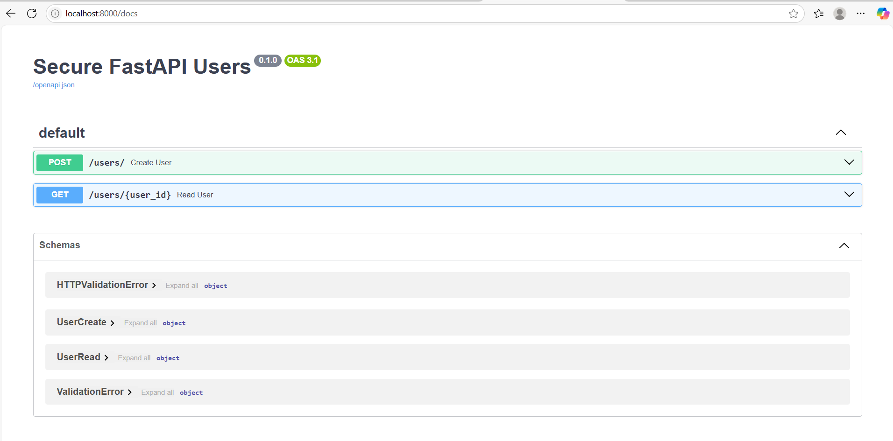

# 🚀 Secure FastAPI Users

A FastAPI-based user managment system featuring:

- Secure password hashing with 'bcrypt'
- SQLAlchemy ORM with PostgreSQL
- Pydantic schemas for data validation
- Full unit/integration test coverage
- Dockerized services with Compose
- GitHub Actions CI/CD pipeline with DockerHub deployment

## 📁 Project Structure

```bash
secure_fastapi_app/
├── app/
│ ├── main.py
│ ├── models.py
│ ├── schemas.py
│ ├── database.py
│ ├── utils.py
│ └── init.py
├── tests/
│ ├── test_unit.py
│ └── test_api.py
├── Dockerfile
├── docker-compose.yml
├── requirements.txt
├── pytest.ini
└── .github/workflows/ci.yml
```
## 🐳 Docker Setup

### ✅ Build and Run locally with Docker Compose

```bash
# Step 1: Build and run the containers

docker-compose up --build
```
# 🧪 Running Tests Locally (with Coverage)

### Create and active virtual environment, install dependencies

```bash
python -m venv venv
venv/Scripts/activate     # On mac use: source venv/bin/activate
pip install -r requirements.txt
```
# Run the tests
```bash
# 1. Run all tests normally
pytest

# 2. Run tests quietly (minimal output)
pytest -q

# 3. Run tests with coverage for the 'app' directory
pytest --cov=app

# 4. Run tests with coverage and show missing lines
pytest --cov=app --cov-report=term-missing
```

# 🔁 Continuous Integration / Deployment
## GitHub Actions CI
- ✅ Triggers on push to any branch
- ✅ Run pytest and checks coverage
- ✅ Uses a PostgreSQL service during integration tests

## DockerHub Deployment
- ✅ Image is pushed to DockerHub automatically after successful tests.

# 🧬 Environment Variables
#### Make sure to set the following environment variable(in .env or system env)
```bash
DATABASE_URL=postgresql://postgres:postgres@db:5432/secure_fastapi
```

🔗 Projcet Links

  - GitHub Repository: https://github.com/jaydrava/secure-fastapi-app.git
  - DockerHub Repository: https://hub.docker.com/repository/docker/jaydrava/secure-fastapi-app

📝 Reflection

*This project helped reinforce concepts of secure user modeling using SQLAlchemy and Pydantic. Implementing password hashing and validation taught me how to prevent critical security vulnerabilities. I also gained practical experience with CI/CD pipelines using GitHub Actions and DockerHub, simulating a real-world professional DevOps environment. completing this taught me persistence and sharpened my backend and infrastructure skills.*

## 📷 Screenshots

### ✅ GitHub Actions - Passed Workflow

### ✅ DockerHub Push

-----------------------------------------

-----------------------------------------

### ✅ App Running in Browser

